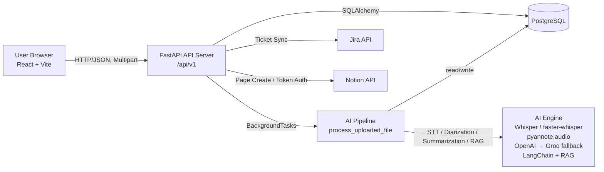
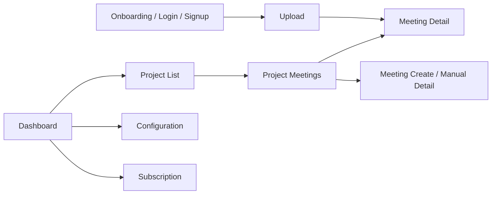
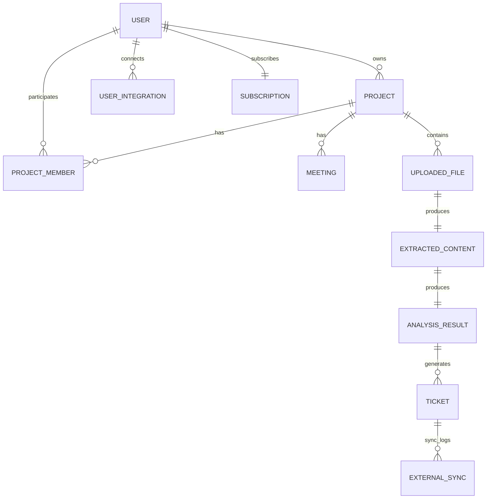
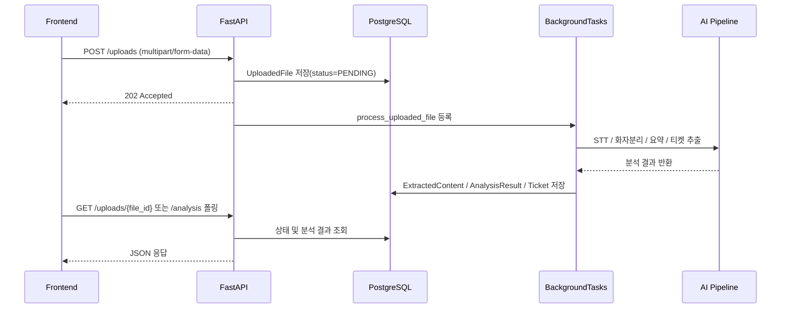
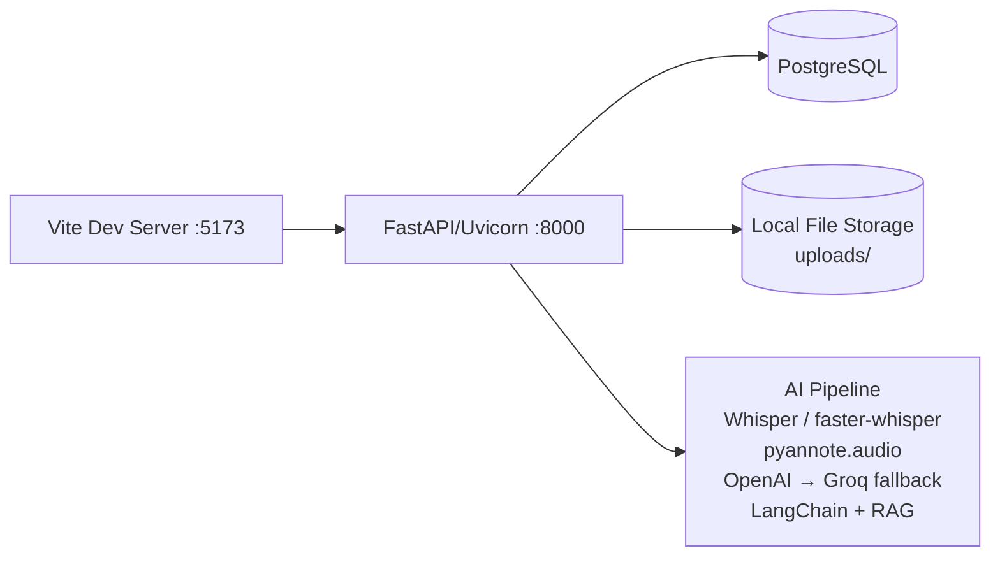
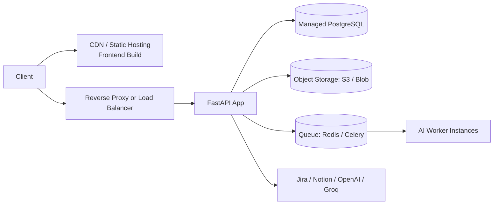

# TIKI 프로젝트 발표/아키텍처 통합 문서

## 1. 프로젝트 개요

TIKI는 회의 음성 또는 문서를 업로드하면 AI가 회의 내용을 구조화하고,
요약/액션아이템/티켓 후보를 자동 생성해 팀이 바로 실행 가능한 상태로 전환하도록 돕는 협업 플랫폼입니다.

- 목표: 회의 직후 정리 시간을 줄이고 실행 항목 누락을 최소화
- 핵심 가치: 회의 기록을 프로젝트 단위의 실행 데이터로 전환
- 주요 사용자: 프로젝트 오너, 팀원, 회의 운영 담당자

---

## 2. 기술 스택

| 구분 | 스택 |
| --- | --- |
| Frontend | React, Vite, JavaScript, React Router |
| Backend | FastAPI, Python |
| ORM/DB | SQLAlchemy, Alembic, PostgreSQL (개발 환경 일부 SQLite 대응) |
| 인증 | Bearer Token 기반 인증 + localStorage 세션 |
| AI 처리 | Whisper / faster-whisper, pyannote.audio, silero-vad, OpenAI, Groq fallback, LangChain, RAG |
| 비동기 처리 | FastAPI BackgroundTasks 기반 워커 파이프라인 |
| 외부 연동 | Jira REST API, Notion API / 토큰 기반 연동 |
| 문서 처리 | PDF, DOCX, DOC, TXT/MD, HWP/HWPX 파싱 |
| 운영 | Uvicorn, 환경변수 기반 설정(.env), Health Check API |

---

## 3. 시스템 아키텍처

### 3.1 서비스 전체 구조

- Web Client: 파일 업로드, 프로젝트/회의/티켓 UI
- API Server(FastAPI): 인증, 도메인 로직, 권한 검증, 업로드 수신
- AI Pipeline: FastAPI BackgroundTasks 기반으로 STT, 화자분리, 요약, 액션아이템 추출, RAG 재요약 처리
- DB(PostgreSQL): 사용자/프로젝트/업로드/분석/티켓 영속화
- External Services: Jira, Notion, OpenAI/Groq

### 3.2 아키텍처 다이어그램

---

## 4. 핵심 기능

1. 회원가입/로그인/내 정보 조회 기반 인증 체계
2. 프로젝트/멤버 초대/응답/회의 관리 협업 기능
3. 오디오/문서 업로드와 비동기 AI 분석 파이프라인
4. 분석 결과 기반 티켓 생성 및 상태 관리
5. Jira/Notion 외부 동기화
6. 구독 플랜 조회 및 변경

---

## 5. 주요 기능

### 5.1 인증/사용자

- 회원가입, 로그인, 현재 사용자 조회/수정
- 보호 라우트에서 토큰 유효성 검증

### 5.2 프로젝트/회의

- 프로젝트 생성/조회/수정/삭제
- 프로젝트 멤버 초대/제거
- 내 초대 목록 조회, 초대 수락/거절
- 프로젝트별 회의 생성/조회/수정/삭제
- 프로젝트 통계(업로드 상태/회의 수/티켓 수)

### 5.3 업로드/AI 분석

- 오디오/문서 다중 업로드
- 업로드 후 백그라운드 분석 실행
- 분석 결과 조회(요약, 액션아이템, 메타데이터)
- 실패 파일 재처리(retry)

### 5.4 티켓/외부 연동

- 티켓 조회/수정/삭제
- 프로젝트 또는 파일 기준 티켓 조회
- Jira 동기화, Notion 동기화, 동기화 이력 저장

### 5.5 구독/운영

- 구독 요금제 목록 조회
- 내 구독 조회 및 플랜 변경
- 서버/DB 헬스체크

---

## 6. 화면 라우트

| Path | 설명 |
| --- | --- |
| / | 인증 상태에 따라 `/upload` 또는 `/onboarding`으로 분기 |
| /onboarding | 온보딩 화면 |
| /login | 로그인 |
| /signup | 회원가입 |
| /upload | 파일 업로드 및 분석 시작 |
| /dashboard | 대시보드 |
| /project-list | 프로젝트 목록 |
| /create-project | 프로젝트 생성 |
| /project/:projectId/meetings | 프로젝트별 회의 목록 |
| /meeting-create | 수동 회의록 생성 |
| /meeting-detail | 회의록 상세 |
| /meeting-manual-detail | 수동 회의록 상세 |
| /configuration | 연동/설정 관리 |
| /mypage | 마이페이지 |
| /subscription | 구독 플랜 화면 |
| /subscription/checkout | 구독 체크아웃 |
| /subscription/complete | 구독 완료 |
| /landing | 랜딩 페이지 |
| /contact | 문의/연락 페이지 |

화면 흐름:

---

## 7. 데이터 모델

### 7.1 핵심 엔티티

| 모델 | 설명 |
| --- | --- |
| User | 사용자 계정, 역할, 활성 상태 |
| Project | 프로젝트 메타정보, 소유자, Jira/Notion 연동 설정 |
| ProjectMember | 프로젝트 참여 사용자, 초대 상태, 권한 |
| Meeting | 프로젝트 회의 메타정보, 요약, 액션아이템 |
| UploadedFile | 업로드 파일 메타, 처리 상태, 파일 종류 |
| ExtractedContent | 원문 텍스트, 마스킹 텍스트, 추출 방식 |
| AnalysisResult | AI 분석 결과(요약, 액션아이템, 메타데이터) |
| Ticket | 분석 결과에서 생성된 작업 티켓 |
| ExternalSync | 티켓의 Jira/Notion 동기화 이력 및 상태 |
| UserIntegration | 사용자별 외부 서비스 OAuth 토큰 |
| Subscription | 사용자 구독 플랜, 청구 주기 |

### 7.2 ERD/주요 관계

주요 관계 요약:

- 프로젝트 1:N 회의
- 프로젝트 멤버는 invite_status(pending/accepted/declined)와 invited_by_id, responded_at을 가집니다.
- 업로드 파일 1:1 추출본문 1:1 분석결과
- 분석결과 1:N 티켓
- 티켓 1:N 외부 동기화 로그

---

## 8. 프로젝트 구조

TIKI/
├─ frontend/
│  ├─ src/
│  │  ├─ api/
│  │  ├─ assets/
│  │  ├─ components/
│  │  ├─ data/
│  │  ├─ hooks/
│  │  ├─ pages/
│  │  ├─ App.jsx
│  │  └─ main.jsx
│  └─ package.json
├─ backend/
│  ├─ app/
│  │  ├─ api/
│  │  │  └─ v1/
│  │  ├─ core/
│  │  ├─ db/
│  │  ├─ integrations/
│  │  ├─ models/
│  │  ├─ schemas/
│  │  ├─ services/
│  │  │  ├─ ai/
│  │  │  ├─ pipeline/
│  │  │  └─ ai_engine.py
│  │  ├─ workers/
│  │  ├─ database.py
│  │  └─ main.py
│  ├─ alembic/
│  └─ requirements.txt
├─ tmp/
├─ README.md
└─ PROJECT_FEATURES.md

---

## 9. 기능별 기술 요약

| 기능 | 사용 기술 | 요약 |
| --- | --- | --- |
| 인증/세션 | FastAPI Dependency, Bearer Token, localStorage | 로그인 후 토큰 기반 인증을 수행하고 프론트 세션을 유지합니다. |
| 프로젝트 협업 | FastAPI Router, SQLAlchemy 관계 모델 | 프로젝트/멤버/회의를 CRUD로 관리하고 접근 권한을 검사합니다. |
| 업로드 파이프라인 | multipart 업로드, BackgroundTasks, workers/tasks | 파일 저장 후 비동기 분석 작업을 실행하고 상태를 추적합니다. |
| AI 분석 | Whisper / faster-whisper, pyannote.audio, silero-vad, OpenAI/LangChain, Groq fallback, RAG | 회의 음성/문서를 구조화된 요약, 액션아이템, 이슈로 변환합니다. |
| 티켓 워크플로우 | Ticket API, 상태/우선순위 Enum | 분석 산출물을 실행 가능한 티켓으로 관리하고 수정/삭제를 지원합니다. |
| 외부 연동 | Jira REST, Notion API | 티켓을 외부 도구로 동기화하고 성공/실패 이력을 저장합니다. |
| 구독 관리 | Subscription API, 플랜 카탈로그 | 요금제 조회와 사용자별 구독 플랜/청구주기 변경을 처리합니다. |
| 운영 안정성 | Health API, Alembic 마이그레이션 | 서버/DB 상태 점검과 스키마 이력 관리를 제공합니다. |

---

## 10. API 설계

기본 Prefix: /api/v1

### 10.1 인증/사용자

| Method | Path | 설명 | 인증 |
| --- | --- | --- | --- |
| POST | /api/v1/auth/signup | 회원가입 + 토큰 발급 | 선택 |
| POST | /api/v1/auth/login | 로그인 + 토큰 발급 | 선택 |
| GET | /api/v1/auth/me | 현재 로그인 사용자 조회 | 필요 |
| GET | /api/v1/auth/users/lookup | 이메일 기반 사용자 조회(초대용) | 필요 |
| PATCH | /api/v1/auth/me | 현재 사용자 정보 수정 | 필요 |

### 10.2 프로젝트/회의/멤버

| Method | Path | 설명 | 인증 |
| --- | --- | --- | --- |
| GET | /api/v1/projects | 프로젝트 목록 조회 | 필요 |
| POST | /api/v1/projects | 프로젝트 생성 | 필요 |
| GET | /api/v1/projects/invitations | 내 프로젝트 초대 목록 조회 | 필요 |
| POST | /api/v1/projects/invitations/{invitation_id}/accept | 프로젝트 초대 수락 | 필요 |
| POST | /api/v1/projects/invitations/{invitation_id}/decline | 프로젝트 초대 거절 | 필요 |
| GET | /api/v1/projects/{project_id} | 프로젝트 상세 조회 | 필요 |
| PATCH | /api/v1/projects/{project_id} | 프로젝트 수정 | 필요 |
| DELETE | /api/v1/projects/{project_id} | 프로젝트 삭제 | 필요 |
| GET | /api/v1/projects/{project_id}/stats | 프로젝트 통계 조회 | 필요 |
| GET | /api/v1/projects/{project_id}/uploads | 프로젝트 업로드 목록 조회 | 필요 |
| GET | /api/v1/projects/{project_id}/meetings | 프로젝트 회의 목록 조회 | 필요 |
| POST | /api/v1/projects/{project_id}/meetings | 회의 생성 | 필요 |
| GET | /api/v1/projects/{project_id}/meetings/{meeting_id} | 회의 상세 조회 | 필요 |
| PATCH | /api/v1/projects/{project_id}/meetings/{meeting_id} | 회의 수정 | 필요 |
| DELETE | /api/v1/projects/{project_id}/meetings/{meeting_id} | 회의 삭제 | 필요 |
| GET | /api/v1/projects/{project_id}/tickets | 프로젝트 티켓 목록 조회 | 필요 |
| POST | /api/v1/projects/{project_id}/members | 멤버 초대 | 필요 |
| DELETE | /api/v1/projects/{project_id}/members/{member_id} | 멤버 제거 | 필요 |

### 10.3 업로드/분석/티켓

| Method | Path | 설명 | 인증 |
| --- | --- | --- | --- |
| GET | /api/v1/uploads | 업로드 파일 목록 조회 | 필요 |
| POST | /api/v1/uploads | 파일 업로드 + 분석 작업 등록 | 필요 |
| GET | /api/v1/uploads/{file_id} | 업로드 파일 상세 조회 | 필요 |
| POST | /api/v1/uploads/{file_id}/retry | 실패 파일 재분석 요청 | 필요 |
| DELETE | /api/v1/uploads/{file_id} | 업로드 파일 삭제 | 필요 |
| GET | /api/v1/uploads/{file_id}/analysis | 파일의 분석 결과 조회 | 필요 |
| GET | /api/v1/uploads/{file_id}/tickets | 파일 기준 티켓 목록 조회 | 필요 |
| GET | /api/v1/tickets/{ticket_id} | 티켓 상세 조회 | 필요 |
| PATCH | /api/v1/tickets/{ticket_id} | 티켓 수정 | 필요 |
| DELETE | /api/v1/tickets/{ticket_id} | 티켓 삭제 | 필요 |

### 10.4 외부 연동/구독/헬스체크

| Method | Path | 설명 | 인증 |
| --- | --- | --- | --- |
| GET | /api/v1/integrations/notion/authorize | Notion OAuth 시작(리다이렉트) | 필요 |
| GET | /api/v1/integrations/notion/callback | Notion OAuth 콜백 처리 | 선택 |
| GET | /api/v1/integrations/notion/status | Notion 연결 상태 조회 | 필요 |
| POST | /api/v1/integrations/tickets/{ticket_id}/sync/jira | 티켓 Jira 동기화 | 필요 |
| POST | /api/v1/integrations/tickets/{ticket_id}/sync/notion | 티켓 Notion 동기화 | 필요 |
| GET | /api/v1/subscription/plans | 구독 요금제 목록 조회 | 선택 |
| GET | /api/v1/subscription/me | 내 구독 정보 조회 | 필요 |
| POST | /api/v1/subscription/subscribe | 구독 플랜/주기 변경 | 필요 |
| GET | /api/v1/health | API 상태 확인 | 선택 |
| GET | /api/v1/health/db | DB 연결 상태 확인 | 선택 |

통신 규칙:

- Base URL: {VITE_API_BASE_URL} (권장: http://127.0.0.1:8000/api/v1)
- 인증: Authorization: Bearer <token>
- 일반 요청: application/json
- 업로드 요청: multipart/form-data

---

## 11. 풀스택 통신 흐름

---

## 12. 배포 구조

현재 저장소 기준으로는 Docker/Compose 파일 없이 앱 프로세스 중심 배포 구조입니다.

### 12.1 개발 배포 구조

### 12.2 운영 배포 권장 구조

운영 권장사항:

- 업로드 파일은 로컬 디스크 대신 오브젝트 스토리지로 분리
- AI 처리 워커를 API 프로세스와 분리해 확장성 확보
- 시크릿/토큰은 환경변수 및 시크릿 매니저로 관리

---

## 13. 문제 해결 포인트 (개발 검증 + 코드 반영)

아래 4개 항목은 운영 장애 회고가 아니라, 개발/검증 과정에서 확인한 리스크를 실제 코드에 반영한 안정화 항목입니다.
프론트엔드, 백엔드, AI, 외부 연동 관점을 각각 포함했습니다.

1. [Frontend] API 호출 공통화와 인증 만료 처리
- API_BASE_URL을 환경변수 기준으로 통일하고, 요청 헤더/응답 파싱/예외 처리를 request 함수로 일원화
- 401 응답은 공통 메시지 + ApiError(status)로 전달해 화면 단에서 일관되게 대응

2. [Backend] 업로드/재처리 방어 로직
- 업로드를 1MB 청크로 저장하고 파일당 1GB 제한을 적용, 초과 시 저장 파일 즉시 삭제 후 예외 반환
- retry API는 FAILED 상태만 허용하고, 원본 파일이 없으면 file_missing으로 재처리 중단

3. [AI] STT 엔진 실패 시 자동 폴백
- 기본 Whisper 엔진 처리 실패 시 openai-whisper로 자동 재시도
- 단일 STT 엔진 오류가 전체 분석 파이프라인 실패로 바로 전이되지 않도록 연속성 확보

4. [AI + Integration] LLM 다중 폴백 및 재시도
- OpenAI 요청은 네트워크/타임아웃/레이트리밋 계열 오류에 대해 최대 3회 재시도
- OpenAI 실패 시 Groq로 폴백하고, Groq도 실패하면 heuristic 서비스로 최종 폴백

---

## 14. 향후 개선 계획

1. 배포/인프라 고도화
- Docker Compose 및 CI/CD 파이프라인 도입
- API/Worker 분리 배포 및 오토스케일 적용

2. 데이터/관측성 강화
- OpenTelemetry, 중앙 로그, 에러 모니터링 연동
- 파이프라인 단계별 처리시간/실패율 대시보드 구축

3. 제품 기능 확장
- 티켓 승인 워크플로우(초안 -> 검토 -> 확정)
- 회의 템플릿 고도화(팀/도메인별 프롬프트)
- 멤버 권한 세분화(owner/editor/viewer)

4. AI 품질 개선
- 파일 타입별 프롬프트/모델 라우팅 최적화
- 분석 품질 평가셋 자동 회귀 검증
